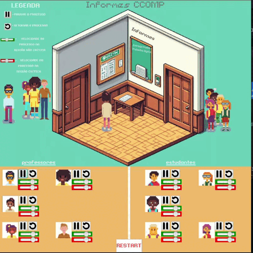

# Problema Clássico dos Leitores e Escritores

## Descrição do Problema Clássico

O **Problema Clássico dos Leitores e Escritores** é um cenário desafiador em sistemas concorrentes, onde diversos processos, representados como leitores e escritores, competem pelo acesso a um recurso compartilhado, como um banco de dados ou uma região crítica na memória. O objetivo principal é garantir a consistência e integridade dos dados, evitando conflitos entre as operações de leitura e escrita.

### Características do Problema:
- **Leitores:** Podem acessar a região compartilhada simultaneamente para leitura.
- **Escritores:** Realizam operações de escrita de forma exclusiva, impedindo outros leitores ou escritores de acessarem a região durante esse processo.
- Evitar problemas como leitura suja, escrita suja e leitura e escrita simultâneas.

## Demonstração do Funcionamento

## Como Executar

1. **Clone o Repositório:** `git clone https://github.com/jvmaiscedo/readers-and-writers-problem.git`
2. **Navegue até o Diretório do Projeto:** `cd readers-and-writers-problem`
3. **Execute o Programa:** `javac Principal.java -> java Principal`
